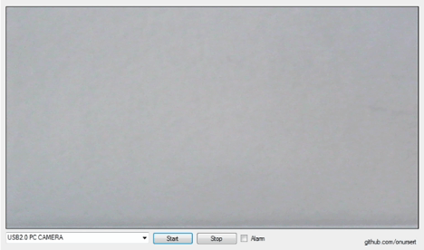

# Motion Detection

Motion Detection (with AForge.NET) - 2015 (C#)

Motion Detection is a tool for Windows PCs that allow you to detect a movement in live camera.

The interface consists of a screen that shows the camera output (you can choose any camera that connects your computer) for motion detection. Also there is alarm option when anything in motion is detected in front of the selected PC camera. This app uses <a href="http://www.aforgenet.com/framework/">AForge.NET Framework</a> for motion detection.

Motion Detection app doesn't require installation.

<a href="https://github.com/onursert/MotionDetection/raw/master/MotionDetection.zip">Download Motion Detection</a>
